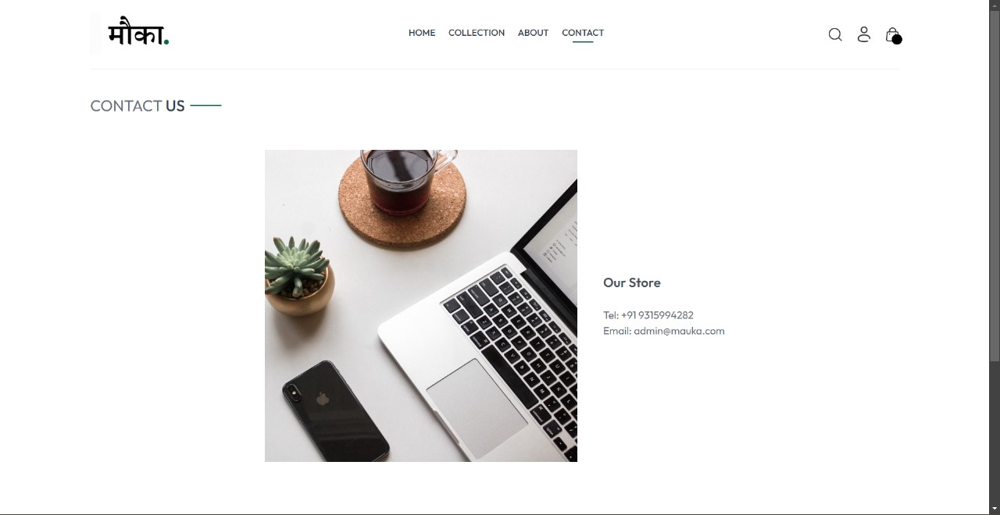
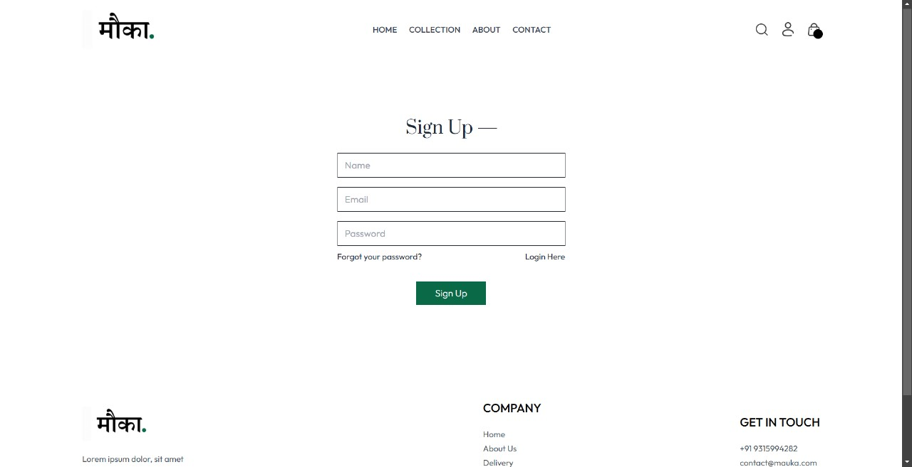
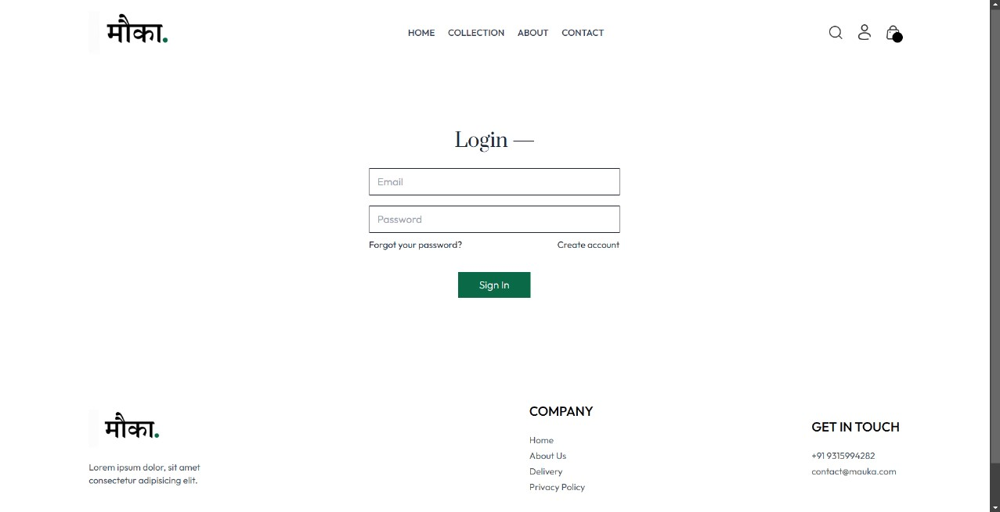
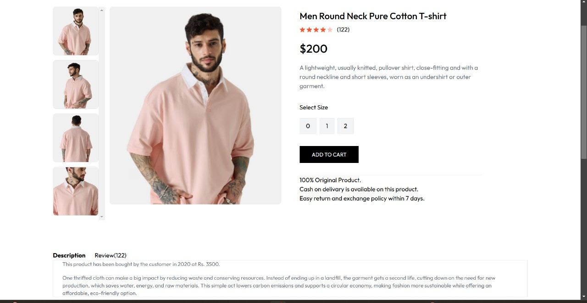

# Mauka.🌿  
**"Make Secondhand Second Nature"**

## **About the Project**  
*Mauka.* which means "chance" in Hindi, embodies the idea of giving a second chance to pre-loved items.  

We are an online thrift store designed to redefine shopping by offering a sustainable, affordable, and stylish alternative to traditional retail by providing a wide range of secondhand goods, from clothes and jewelry to furniture and artwork.  

With a focus on sustainability, Mauka promotes a circular economy by encouraging the reuse and recycling of pre-loved items. Our platform enables users to buy and sell gently used products, offering an affordable, stylish, and eco-friendly shopping experience.  
## **Features**  
- **Browse Categories**: Discover secondhand treasures, including clothes, furniture, and art.  
- **Sell with Ease**: List your gently used items for others to enjoy.  
- **Eco-Friendly Shopping**: Support sustainability through mindful consumption.  
- **Affordable Alternatives**: Access quality goods at great prices.  
- **User-Friendly Design**: Built with React.js and TailwindCSS for a seamless experience.  
## **Tech Stack**  
- **Frontend**: React.js  
- **Styling**: TailwindCSS  
- **Functionality**: JavaScript  
## **Usage**  
- **Browse Pre-Loved Items**: Explore items by category, such as clothes, furniture, jewelry, and more.  
- **Sign Up**: Create an account to buy or sell gently used items effortlessly.  
- **Enjoy the Experience**: Shop sustainably while finding unique and stylish products at great prices!

## Header

## Latest Collection

## Best Seller

## Contact Us

## Collection Page

## SignUp

## Login

## Product Description

## **Installation Instructions**  
1. Clone the repository:  
   ```bash  
   git clone https://github.com/your-repo/mauka.git  
